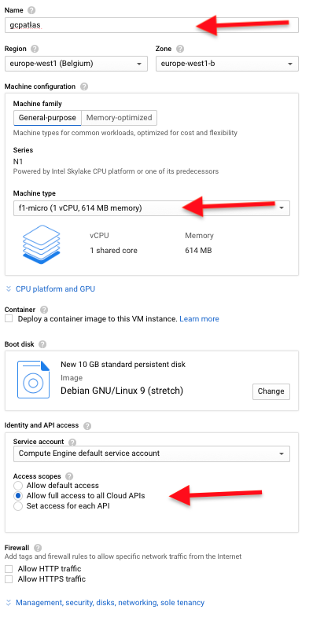

# GCP Instance Setup

* Create a micro Ubuntu 19.04 GCE VM instance in 'europe-west1 (Belgium)' following these step by step instructions...

* Using the top left hamburger menu, select "Compute Engine" and from the sub menu select "VM Instances", like in picture below

> 

* If you do this for the first time an initialization dialogue is shown. Like below

> 

* When complete, click "Create".

* Fill out the form as below, making sure to select the same "Region" as that of the MongoDB Atlas cluster you created previously, e.g., "europe-west1 (Belgium)". The value for "Zone" is not relevant.  Be sure to select: "Allow full access to all Cloud APIs"

> 

* Click the "Create" button at the end of the page to continue.

* Next, in the search box at the top, enter “Firewall” and select the matching suggestion "Firewall Rules VPC network”. **Note:** *Do not* select the firewall rules option for App Engine**

> 

* Click “Create Firewall Rule” at the top to create a new rule to open up the needed port for our new server

> 

* Enter the following details and click “Create”:

```
Name: gcpatlasdemo
Targets: All instances in the network
Source IP ranges:  0.0.0.0/0
Protocols and ports:  
    tcp: 8088-8089
``` 

> 

* Make sure you have completed the [GCP Projct & Vision API setup](GCPProjectAndVisionSetup.md) at this point.

* Go back to the Compute Engine page to list all VM instances.

> 

* After your instance is created, SSH to your instance by clicking on the SSH button of your instance.

> 

* You should see a CloudShell window similar to this open...

> 

* Run the following commands from the command line:

```
  sudo apt-get update
  sudo apt-get install -y python3-pip
  sudo apt-get install -y git
  git clone https://github.com/rbohan/MongoDBAtlas-GCP-AIMLv2.git
  cd MongoDBAtlas-GCP-AIMLv2/FinishedSampleCode
  python3 -m pip install -r requirements.txt
```

Please note that it may not be possible to copy/paste the entire block above into Cloud Shell in one go. In this case please copy/paste line-by-line, or use the following single line command:

```
  sudo apt-get update ; sudo apt-get install -y python3-pip ; sudo apt-get install -y git ; git clone https://github.com/rbohan/MongoDBAtlas-GCP-AIMLv2.git ; cd MongoDBAtlas-GCP-AIMLv2/FinishedSampleCode ; python3 -m pip install -r requirements.txt
```
 

* Edit the `gcpcreds.json` and replace the contents with the credentials from the JSON file you downloaded earlier (when creating the service credentials).
* Edit `settings.cfg` and update it with the Atlas connection string created earlier
* Run `python3 runner.py` to start the application
* Visit the URL of your server port 8088 and you should see a web page
  * e.g. if the public IP address of your Google Cloud instance is 12.23.45.56, open a browser and visit http://12.23.45.56:8088
* Try to enter an image URL into the entry field to have the image analysed by Google Vision API
  * https://storage.googleapis.com/demo-visionapi-atlas/Marketing/eiffel-tower.jpg

* Clicking "insert" results in the webpage displaying the change stream documents, showing the insert of the document for the URL along with the update operation after the Google Vision API returns results of its analysis:

> 
